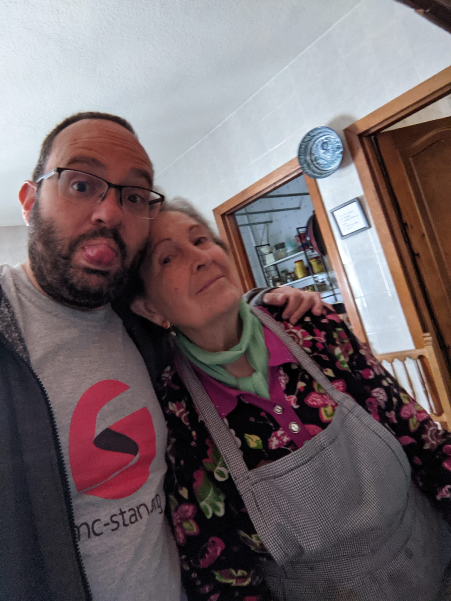
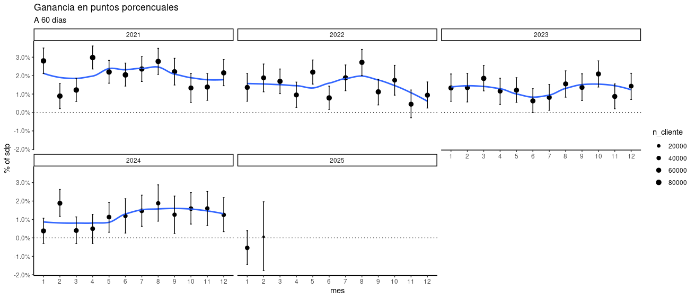

## [Sobre mi]{style="color: #000000;"} {.dark background-color="#333333"}

<br>

::: columns
::: {.column width="50%"}
{#headshot height="500px"}
:::

::: {.column width="50%"}
-   Soy José Luis Cañadas Reche 👋
-   Data Scientist/ Estadístico 💻
-   ️MasOrange 🍊
-   En unas semanas 🏡
:::
:::

## <span style="color: #ffffff;"> ¿Quién fui/soy yo? {.light background-color="#ffffff"}

<br>

::: columns
::: {.column width="50%"}
::: incremental
-  Alumno de esta facultad. No especialmente brillante los primeros años
-  Becario en el IECA.
-  Otras cosas raras
-  Estadístico en Instituto de Estudios Sociales de Andalucía (IESA)
::: 
::: 

::: {.column width="50%"}
::: incremental
-  Data Scientist como dicen los modernos  
-  Vicepresidente de la asociación [R-Hispano](https://www.r-es.org)
-  Bloguero [Muestrear no es pecado](https://muestrear-no-es-pecado.es/)
-  Podcaster [CuaRtil](https://open.spotify.com/show/3Ku9xHJdqu4g3VM5maolr7?si=6f37997d31794646)
:::
::: 
:::

## <span style="color: #ffffff;"> ¿Cómo acabé en esto del "Bigdata"?  {.light background-color="#ffffff"}


<br>

::: fragment

Avatares del destino

:::

::: columns
::: {.column width="50%"}
::: incremental

-  Fin de contrato en el IESA
-  En Andalucía es/era díficil encontrar trabajo de estadístico
-  Migración a Madrid
:::
:::
::: {.column width="50%"}
::: incremental

-  Consultora y Telefónica. 2016- 2018 
-  Orange. 2018-2025
:::

:::
:::

## <span style="color: #ffffff;"> ¿Qué es esto del "Bigdata"? ¿Y la ciencia de datos?  {.light background-color="#ffffff"}

<br>

::: columns
::: {.column width="50%"}
::: incremental
-  Nadie tiene muy claro qué es BigData. ¿Lo de las 5 V's? 
-  En realidad no importa mucho cómo se defina. 
-  Es un "hype", igual que ahora el nuevo "hype" es la IA.
::: 
::: 

::: {.column width="50%"}
::: incremental
- Data Science exists because Statistics (as a field) missed the boat on computers.
- Lo de "ciencia" en ciencia de datos es "cuestionable"
:::
::: 
:::

## <span style="color: #ffffff;"> ¿Y qué tiene que ver con la Estadística? {.light background-color="#ffffff"}

<br>

::: incremental
- Elements of Statistical Learning
- The two cultures. Aunque prefiero [las tres culturas](https://www.datanalytics.com/2018/07/11/las-tres-culturas/)
- [Prediction, estimation, attribution](https://med.stanford.edu/content/dam/sm/dbds/documents/biostats-workshop/paper-1-.pdf) . [Mi punto de vista](https://muestrear-no-es-pecado.es/2020/06/07/predicci%C3%B3n-estimaci%C3%B3n-atribuci%C3%B3n/)
- Inferencia Causal
- Pero ¿sólo hace falta estadística o sólo computación ? 
::: 

## <span style="color: #ffffff;"> ¿Qué pintamos los estadísticos?  {.light background-color="#ffffff"}

¿Qué debería hacer un estadístico para ser un buen científico de datos?

::: incremental

-  Aprender a programar, ¿R, Python, sql, julia, Rust, C++ ? 
-  Entender el campo de aplicación, negocio, ciencia. 
-  Saber contar historias con datos y transmitir conceptos complejos de forma simple.
-  Mucha gente se empeña solo en programar y aprender bien un lenguaje. Es útil, pero lo que
os diferencia a vosotros es el pensamiento estadístico. 
-  La estadística es la ciencia de la incertidumbre. 1/3 != 100/300

:::

## <span style="color: #ffffff;"> ¿Qué tiene que cambiar en la formación reglada? {.light background-color="#ffffff"}

::: fragment

¡Ojo!. No sé cómo está ahora

:::

::: incremental

-  Aliarse con la gente de informática. Hay gente muy buena en Granada.
-  Énfasis en la aplicación, sin dejar de lado la rigurosidad.
-  Colaboración con las empresas.
-  Saber vendernos
-  ¿?
:::


## <span style="color: #ffffff;"> Oportunidades {.light background-color="#ffffff"}

::: incremental

-  Es más fácil ser un estadístico con habilidades de programación que al revés.
-  Alfabetización estadística. Muchos DS's actuales no tienen ni idea
-  Comunicar eficazmente la incertidumbre => Mejores decisiones
-  Las empresas están redescubriendo las posibilidades de la IO (ML Prospectivo lo llaman ahora)
:::


## <span style="color: #ffffff;"> Ejemplos en telco.{.light background-color="#ffffff"}


::: incremental

-  Modelos de clasificación. Propensión de compra, fuga de clientes.
-  Marketing Mix Modelling.
-  Análisis de redes.
-  Perfilado de clientes. 

:::


## <span style="color: #ffffff;"> Mensaje para estudiantes y egresados  {.light background-color="#ffffff"}


::: incremental

-  Confía en tu formación estadística
-  No te obsesiones con aprender a programar. ¡Pero aprende!
-  Hay mucho desconocimiento estadístico, incluso en empresas top
-  No dejes de estudiar y aprender, terminar la carrera es sólo el principio
-  Crea un portfolio personal de proyectos, por ejemplo en github
-  Participa en comunidades de datos, como R-Hispano, Pydata.

:::


##  {.transdark background-color="#333333" background-image="images/question-mark-1872665_1280.webp" background-size="99%"}

<h1>

<center>[Bola extra. Detalle casos de uso en Telco]{style="color: #000000;"}</center>

</h1>


## <span style="color: #ffffff;"> Fuga de clientes {.light background-color="#ffffff"}

<br>

::: columns
::: {.column width="40%"}
::: incremental
- Predecir solicitudes de portabilidad. 
- Elegir diariamente clientes con mayor probabilidad de fuga
- Mandar a campaña diaria. Elección grupo de control

- Análisis de accionabilidad. Inferencia causal
:::
:::

::: notes
- >2 Millones de líneas, se usan varios días de datos de entrenamiento. 20 o 40 millones de filas, 200 variables
:::
:::{.column width="60%"}
::: incremental
-  {width=100%}

:::
:::
:::


## <span style="color: #ffffff;"> Marketing Mix Modelling {.light background-color="#ffffff"}

::: incremental

- Básicamente hacen regresiones multivariantes encadenadas
- Se podría mejorar con 
  - Ecuaciones estructurales
  - Modelos bayesianos.
- Se optimizan usando cosas como cplex, gurobi.

:::


## <span style="color: #ffffff;"> SNA {.light background-color="#ffffff"}

::: incremental
<br>

-   50 millones msisdn en cdrs 

-   Histórico 4 meses

-   Matriz de adyacencia 40 Millones x 40 Millones

-   Graphframe de spark

:::

## <span style="color: #ffffff;"> SNA. Definición de vínculo {.light background-color="#ffffff"}

::: incremental
<br>

-   Criterio seleccionar sólo vínculos fuertes

-   $$link_{i,j} = \dfrac{\sum{calls_{i,j}}}{\sum calls_i + \sum calls_j - \sum{calls_{i,j}}} $$

-   Para cada teléfono se obtiene sus contactos importantes a alcance 2. 

:::


## <span style="color: #ffffff;"> SNA {.light background-color="#ffffff"}

[mi egografo](675741067.html)


## <span style="color: #ffffff;"> Perfilado de clientes. Navegación  {.light background-color="#ffffff"}

::: fragment
¡El Álgebra es tu amiga!
:::

::: incremental

-  Navegación web. Anonimizamos tlfs
-  Consideramos las 10 mil urls más visitadas
-  Muestreamos tlfs fijos (20%  nos basta)
-  SVD de la matriz resultante. 400 mil filas  x 10 mil columnas. Matriz muy dispersa


:::


## <span style="color: #ffffff;"> Urls similares  {.light background-color="#ffffff"}

```
> dist_matrix[grep("*.pullandbear.com",rownames(dist_matrix), fixed = TRUE), ] |>  enframe() |> arrange(value)
# A tibble: 9,564 × 2
   name               value
   <chr>              <dbl>
 1 *.pullandbear.com    0  
 2 *.stradivarius.com  68.1
 3 *.pullandbear.net   69.6
 4 *.nagich.com        77.9
 5 *.backmarket.com    85.6
 6 *.bershka.com       86.2
 7 *.backmarket.es     89.9
 8 *.salesmanago.es    94.6
 9 *.turnto.com       101. 
10 *.quickcep.com     104. 

```

## <span style="color: #ffffff;"> Urls similares  {.light background-color="#ffffff"}

```{r}
#| echo: false

library(tidyverse)

umap_out <-  readRDS("./data/umap_out.rds")


umap_plot <- function(umap_out,
                      patrones = NULL,
                      max_points = NULL) {

  
  to_plot <- umap_out |>
    as.data.frame() |>
    rownames_to_column(var = "rowname")
  
  if (!is.null(patrones)) {
    # Si hay varios patrones, construir regex combinado
    regex <- paste(patrones, collapse = "|")
    to_plot <- to_plot |>
      mutate(selected = if_else(str_detect(rowname, regex), "seleccionado", "no_select"))
  } else {
    to_plot <- to_plot |> mutate(selected = "sin_selección")
  }
  
  
  # 5. Pintar
  p <- to_plot |> 
    ggplot(aes(x = UMAP1, y = UMAP2, color = selected, text = rowname)) +
    geom_point(alpha = 0.7, size = rel(4)) +
    viridis::scale_color_viridis(discrete = TRUE, option = "D", alpha = 0.9) +
    theme_minimal(base_size = 13)
  
  plotly::ggplotly(p, tooltip = "text")
}


umap_plot(umap_out, patrones = c(".pullandbear"))


```
##  {.transdark background-color="#333333" background-image="images/question-mark-1872665_1280.webp" background-size="99%"}

<h1>

<center>[Esto es todo. ¿Preguntas?]{style="color: #000000;"}</center>

</h1>


##  {.transdark background-color="#333333"} 

:::columns
::: {.column width="50%"}

__Blog__

{width=80%}
:::
::: {.column width="50%"}

__Podcast__

{width=85%}
:::
:::


